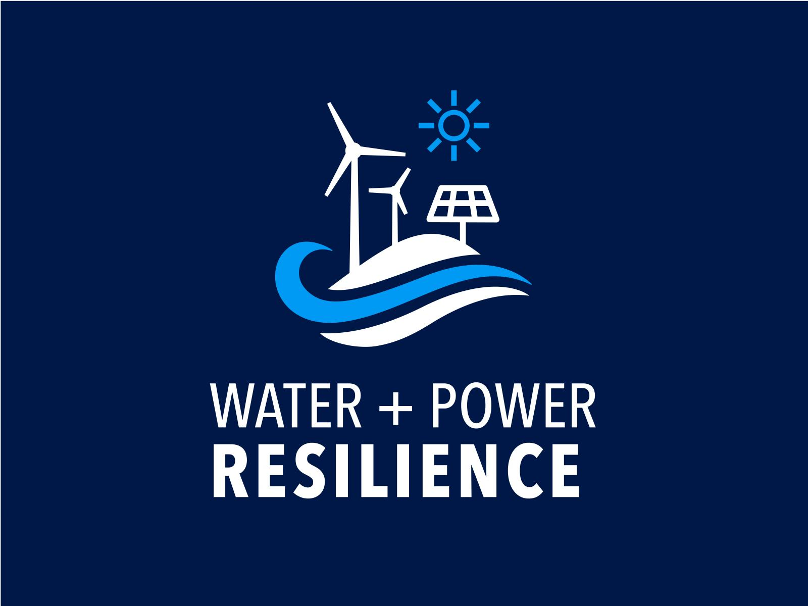
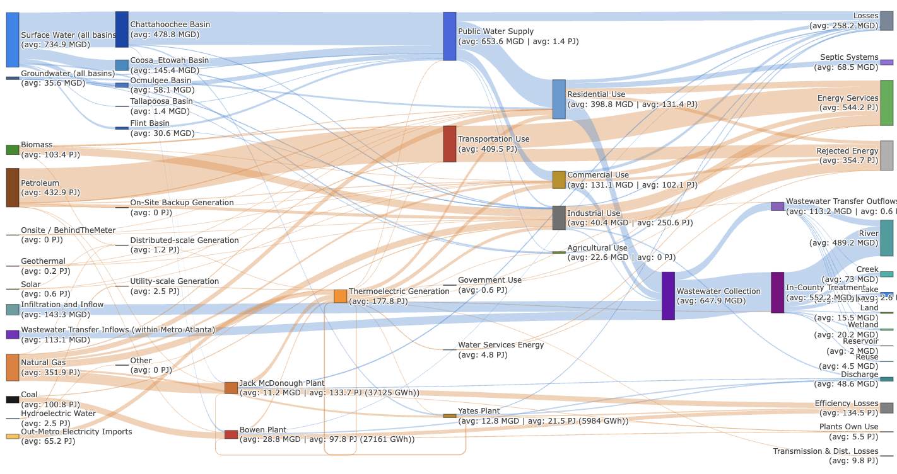

<p align="center">
  
</p>

# MAWEI — Metro Atlanta Water-Energy Interdependencies

Interactive Sankey diagrams quantifying the coupled water and energy flows of the Metro Atlanta region.

## Overview

MAWEI processes publicly available and stakeholder-supplied data (not committed to this repository) on water supply, wastewater, and energy generation/consumption for Metro Atlanta and renders them as interactive, animated Sankey diagrams showing cross-sector interdependencies. The tool supports dynamic year-over-year comparison and export to self-contained HTML files for standalone sharing.

<p align="center">
  
</p>

---

## Repository Structure

```
MAWEI/
├── functions.R                # Shared helpers, constants, Sankey plotting engine
├── data/                      # Processed CSV inputs (EIA, EPD, WMP, etc.)
├── R/
│   ├── flows_water.R          # Water supply, wastewater, and self-supply flows
│   ├── flows_energy.R         # Fuel, generation, and end-use energy flows
│   ├── flows_energy_water.R   # Combined energy-water Sankey (entry point)
│   └── plots.R                # Supplementary maps and charts
├── outputs/files/             # Generated Sankey HTML outputs
├── interface/                 # Browser dashboard (HTML + JS + CSS)
└── MAWEI.bat / MAWEI.command  # Interface launcher (Windows .bat / Linux/macOS .command)
```

---

## Quick Start

### 1 · Open the Dashboard

Double-click or execute [MAWEI.command](MAWEI.command) (Linux/macOS) or [MAWEI.bat](MAWEI.bat) (Windows) to launch the dashboard in your default browser. Alternatively, navigate to the project root in a terminal and run:

```bash
Rscript launch.R
```

This opens `interface/MAWEI.html` in your default browser — no server required.

### 2 · Run the Analysis

Open the project in RStudio (double-click `MAWEI.Rproj`), then source the entry-point script:

```r
source("R/flows_energy_water.R")
```

Scripts resolve all paths relative to their own location, so they work regardless of the session working directory.

---

## Data Sources

| Dataset | Source | Coverage |
|---|---|---|
| EIA SEDS | U.S. Energy Information Administration | 2020–2024 |
| EIA 860 / 923 | EIA — generator & fuel data | 2020–2024 |
| Public Water Supply | GA Environmental Protection Division | Annual |
| Water Management Plans | GA EPD — surface, groundwater, wastewater | Annual |
| Self-supply (Agriculture) | GA EPD | Annual |
| Thermoelectric water use | USGS / EIA | Annual |
| Wastewater treatment | GA EPD NPDES | Annual |
| County FIPS | U.S. Census Bureau | 2024 |

---

## Dependencies

R ≥ 4.0.0 with the following packages. Install all at once:

```r
install.packages(c("dplyr","tidyr","readr","ggplot2","plotly","htmlwidgets",
                   "sf","RColorBrewer","ggsci","purrr","zoo"))
```

---

## Outputs

Sankey diagrams are saved to `outputs/files/` when `SAVE_FILES <- TRUE` in `functions.R`:

| Folder | Content |
|---|---|
| `energy/` | Fuel → generation → end-use energy flows |
| `water/` | Supply → treatment → demand → discharge flows |
| `energy-water/` | Combined energy-water interdependency diagram | 

File Name Pattern: `NN_resolution_county_sector.html` 

### Description
5-year annual energy water flows for Atlanta counties over 2020-2024

- 8 processed data files, 140,000 rows of data
    - Metro Water, County Water
    - Metro Energy, County Energy 
    - Metro Energy Water, County Energy Water
    - Simplified variants (2)

- 2 Resolutions: Metro Atlanta aggregated, 15 counties individually 
    - 3 Sectors: Energy, water, energy-water
        - Data: 6 data files 
        - Diagrams 
            - 1 metro + 15 counties = 16 * 3 = 48 core diagrams 
            - Additional variants: e.g., simplified energy-water diagrams (16)
            - 72 files across resolutions, sectors, data, Sankey diagrams, and variants  

- Interface: open MAWEI.html

---

## Contact
Open an issue or contact Hassan Niazi at [hassan.niazi@pnnl.gov](mailto:hassan.niazi@pnnl.gov) or Kelsey Semrod at [kelsey.semrod@pnnl.gov](mailto:kelsey.semrod@pnnl.gov).

Team: Hassan Niazi, Kelsey Semrod, Kendall Mongird, Jennie Rice, IWPR Team at Pacific Northwest National Laboratory, and Atlanta Stakeholders  

---


<p align="center">
  Developed at <a href="https://www.pnnl.gov">Pacific Northwest National Laboratory</a>
  in support of the <a href="https://www.pnnl.gov/projects/integrated-water-power-resilience-project">Integrated Water Power Resilience Project</a>.
</p>
